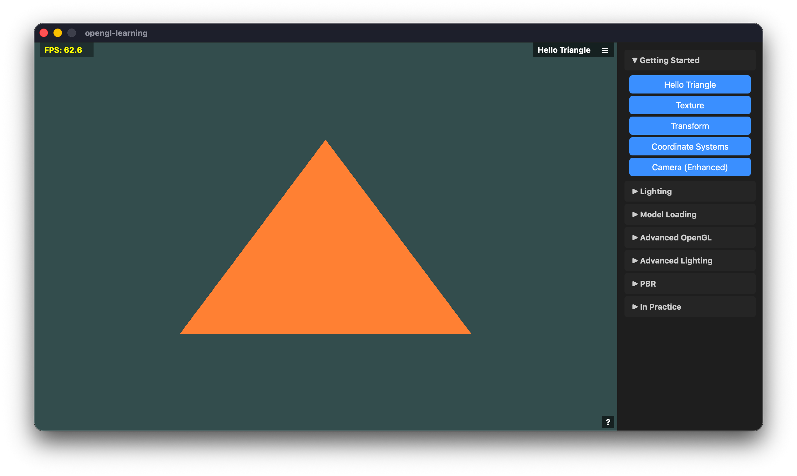

# OpenGL-learning

learn opengl and write c/c++ code in qt for pratice



## precondition

````
brew install qt
````

## build

```
mkdir build
cd build
qmake ..
make
```

## reference
- [https://learnopengl-cn.github.io](https://learnopengl-cn.github.io)
- Most of the code was generated by AI 🤖🤖🤖🤖🤖🤖🤖🤖🤖🤖
